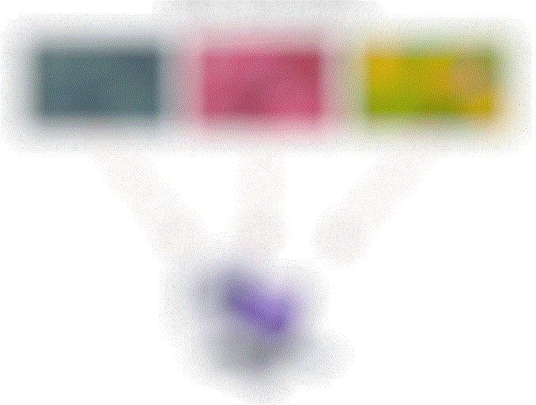

# Raster Tools
Raster Tools is a python package that facilitates a wide range of spatial,
statistical, machine learning analyses using delayed and automated parallel
processing. Our library focuses on significantly reducing processing time and
storage space associated with analyzing large spatial datasets while also
introducing new spatial, statistical, machine learning concepts into an
easy-to-use python based API.

## Helpful Links
- [How to Contribute](./CONTRIBUTING.md)
- [Documentation](./docs/README.md)
- [Notebooks & Tutorials](./notebooks/README.md)
- [PyPi link](https://pypi.org/project/raster-tools/)
- [Installation](./notebooks/install_raster_tools.md)

## Package Dependencies
- [dask](https://dask.org/)
- [dask_image](https://image.dask.org/en/latest/)
- [dask-geopandas](https://github.com/geopandas/dask-geopandas)
- [geopandas](https://geopandas.org/en/stable/)
- [numba](https://numba.pydata.org/)
- [rasterio](https://rasterio.readthedocs.io/en/latest/)
- [rioxarray](https://corteva.github.io/rioxarray/stable/)
- [shapely 2](https://shapely.readthedocs.io/en/stable/)
- [xarray](https://xarray.pydata.org/en/stable/)
